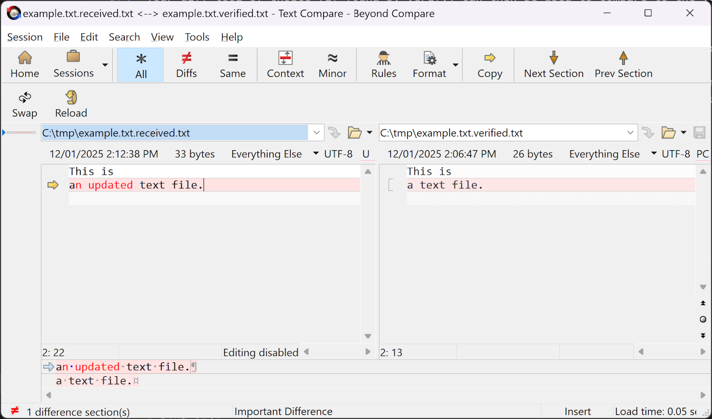

# Verify.Cli

[](https://github.com/flcdrg/Verify.Cli/actions/workflows/dotnet.yml)
[](https://www.nuget.org/packages/Verify.Cli/)

A command-line tool that allows using [Verify](https://github.com/VerifyTests/Verify) for regular files (without requiring you to create a unit test project).

## Usage

If you run interactively, then you'll get a similar experience to using VerifyTests in a .NET unit test project - with the tool looking for any file diff tooling to display the diff.

```bash
./Verify.Cli --file <path to file to verify>
```

The first time you use Verify, it will output the contents of the file.

```pwsh
.\Verify.Cli.exe --file C:\tmp\example.txt
```

```text
Unhandled exception: VerifyException: Directory: C:\tmp
New:
  - Received: example.txt.received.txt
    Verified: example.txt.verified.txt

FileContent:

New:

Received: example.txt.received.txt
This is
a text file.
```

Your diff tool of choice (if found by Verify) can then be used to compare to the verified file (if it exists), or create it (if the first time).

If the verified file matches the received file, then there is no output (and the exit code is zero).

If the received file is different from the verified file, then a diff will be shown in the console, a non-zero exit code will be returned, and if in an interactive environment with a supported diff tool, then that tool will be launched.

```text
Unhandled exception: VerifyException: Directory: C:\tmp
NotEqual:
  - Received: example.txt.received.txt
    Verified: example.txt.verified.txt

FileContent:

NotEqual:

Received: example.txt.received.txt
This is
an updated text file.

Verified: example.txt.verified.txt
This is
a text file.
```

Example with Beyond Compare launched:


